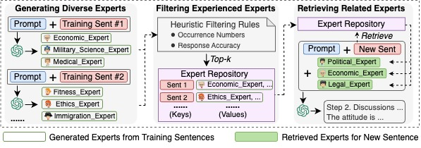
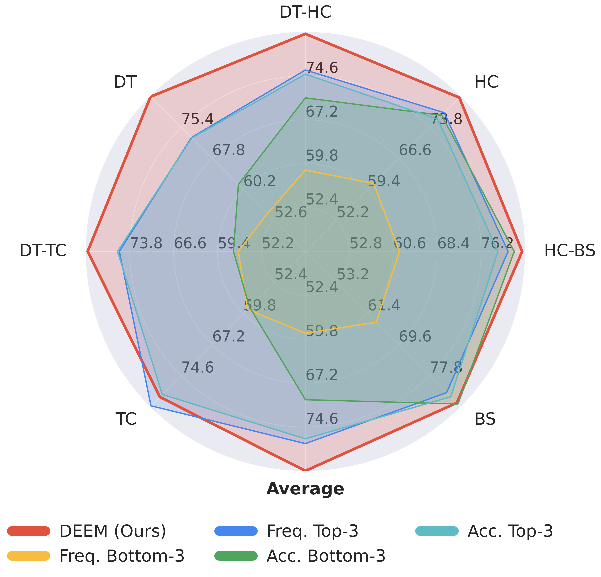
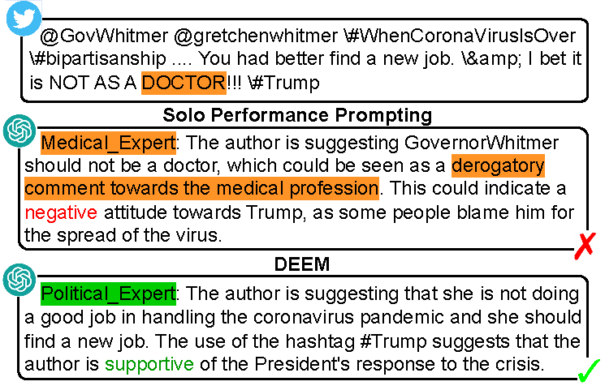

# 🤗 DEEM: Dynamic Experienced Expert Modeling for Stance Detection

This repo includes codes and examples for paper [**📖 ArXiv**][DEEM: Dynamic Experienced Expert Modeling for Stance Detection](https://arxiv.org/pdf/2402.15264).

## Our Method
In this paper, different from existing multi-agent works that require detailed descriptions and use fixed experts, we propose a Dynamic Experienced Expert Modeling (DEEM) method which can leverage the generated experienced experts and let LLMs reason in a semi-parametric way, making the experts more generalizable and reliable. Experimental results demonstrate that DEEM consistently achieves the best results on three standard benchmarks, outperforms methods with self-consistency reasoning, and reduces the bias of LLMs.

The model structures are shown in the following figure.



## Comparison with other methods

| Method | Including Explanations | Multi-Roles | Verified Experts | Reasoning Type|
| --- | --- | --- | --- | --- |
| Few-Shot | ❌| ❌ | - | Gen |
| CoT | ✅ | ❌ | - | Gen |
| Auto-CoT | ✅ | ❌ | - | Re+Gen |
| ExpertPrompt | ✅ | ❌ | ❌| Gen |
| SPP | ✅ | ✅  | ❌| Gen |
| DEEM(ours) | ✅ | ✅  | ✅  | Re+Gen |




## Casestudy



## Reference

📑 If you find our project helpful to your research, please consider citing:
```
@misc{wang2024deem,
      title={DEEM: Dynamic Experienced Expert Modeling for Stance Detection}, 
      author={Xiaolong Wang and Yile Wang and Sijie Cheng and Peng Li and Yang Liu},
      year={2024},
      eprint={2402.15264},
      archivePrefix={arXiv},
      primaryClass={cs.CL}
}
```
